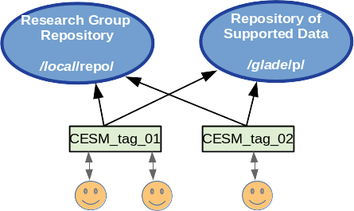
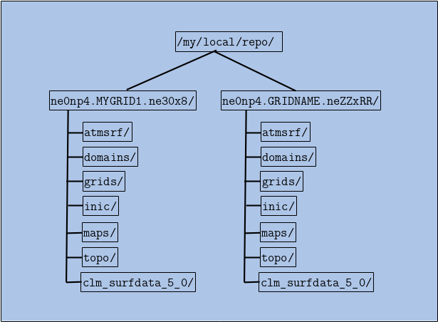

.. _variable-resolution-configurations:

*******************************************
User Defined Variable Resolution Configurations
*******************************************

========================================
Spectral Element Dycore
========================================

With the release of CESM 2.2 users have the ability to create and use variable 
resolution spectral element grids that are suited to their research needs. A fundamental 
limitation for adding custom grids has been that the grid information and all related 
data files for supported CESM grids reside in a readonly repository that users cannot 
modify. To address this limitation a research group can now create, maintain, and share 
a local repository containing the grids and related data tailored to their needs. 
Files that are not specific to the model grid are still obtained from the CESM 
repository unless the user specifies otherwise.

The process of implementing a new custom grid has been simplified as much as possible 
with a set of tools and instructions guiding users through the process, from creation 
of the new grid, to processing the input data CESM needs, to building and running a 
working model for a 5-day test run. The **VRM_tools** for creating new grids are located 
in https://github.com/ESMCI/Community_Mesh_Generation_Toolkit 

The following is a high level overview of the steps for creating and using a new 
variable resolution grid. The **VRM_tools/Docs** directory in this repository contains 
a PDF file fully documenting this process. After going through these steps, the 
user will have constructed all of the necessary files in their own local repository 
with the following directory structure. Each grid configuation can then be readily 
shared with collaborators who have read access to this repository. 

The steps include:

1. Create a new grid using SQuadGen or VRM_Editor.

   +-----------------------------------------------------------------------------------+
   | For spectral element grids, the surface of the Earth is divided into 6 cube faces |
   | and each face is further subdivided into (NE x NE) elements. A standard ne30np4   |
   | uniform 1 degree grid, for example, has faces that are divided into a grid of     | 
   | 30x30 elements.                                                                   |
   | The process of creating a new variable resolution grid begins with the *SQuadGen* |
   | or *VRM_Editor* programs. Starting from a base reolution, these programs          |
   | iterativly subdivide the elements to higher resolutions within user specified     |
   | regions, with each iteration increasing the resolution by a factor of 2.          |
   +-----------------------------------------------------------------------------------+
   

2. Generate standard CESM input datasets for the new grid.

   +-----------------------------------------------------------------------------------+
   | From the refined NE grid, the final variable resolution mesh is created by adding |
   | the specified number of GLL points. (Typically NP=4). These further subdivide     |
   | each element with an (NP x NP) grid which supports the Legendre basis functions.  | 
   | To prepare the grid for use in the model, the user then runs a series of          |
   | processing scripts to create all of the associated input and mapping files that   | 
   | CESM needs. At the end of this process, the user will have a local repository     | 
   | with the directory structure indicated above.                                     |
   +-----------------------------------------------------------------------------------+

3. Create newcase and tune the model parameters until the model runs the 5-day test stably.

   +-----------------------------------------------------------------------------------+
   | To obtain a stable running model configuration, the model time stepping and       |
   | damping parameters are iteratively tuned until the model can sucessfully complete |
   | a 5 day test run.                                                                 |
   +-----------------------------------------------------------------------------------+

4. Update the tuning parameters in the repository files.

   +-----------------------------------------------------------------------------------+
   | Once the initial tuned parameters have been established, the reulting values are  |
   | used to update the configuation files in the local repository and become the      |
   | defaults for the new grid.                                                        |
   +-----------------------------------------------------------------------------------+

5. Run further validation tests for the new grid.

   +-----------------------------------------------------------------------------------+
   | At this point, a longer process of testing and validation begins for the newly    |
   | created grid.                                                                     |
   +-----------------------------------------------------------------------------------+

